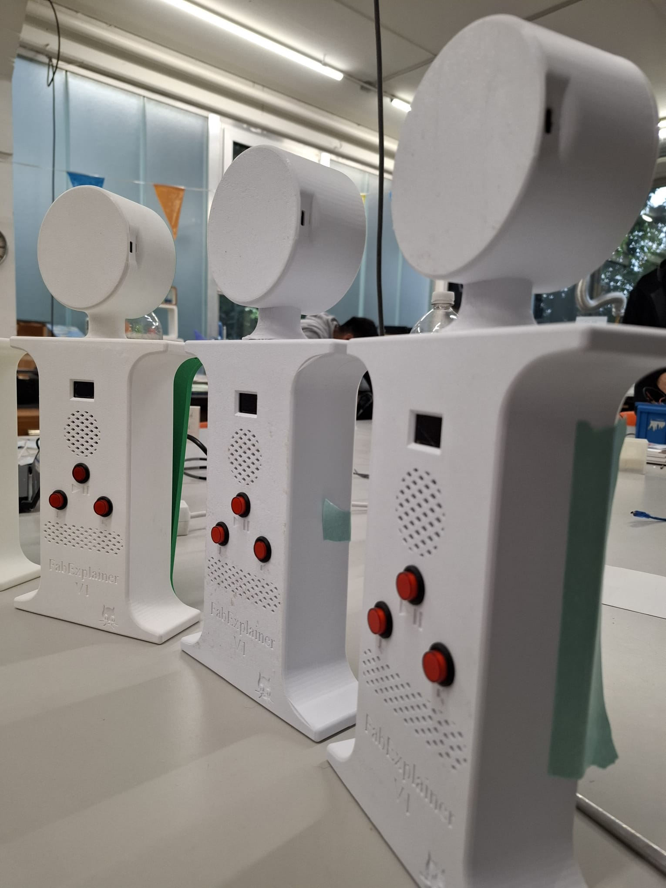

# Audio Guide Box

This project is a simple, self-contained **audio guide box**, powered by an Arduino, an OLED display, and a DFPlayer Mini MP3 module.

It functions like an audio guide system found in museums or exhibitions, with **pre-recorded audio tracks**, **language selection**, **volume control**, and a **built-in screen** for feedback.

---

## 🔧 Features

- 🎧 **Audio Playback** via DFPlayer Mini  
- 🌐 **5 Languages** selectable via hardware switch  
- 🔊 **2 Volume Modes** (Loud / Quiet)  
- ▶️ **Play Button** to trigger playback  
- 📺 **OLED Display** showing:
  - The currently selected language (highlighted)
  - A scrollable list of 3 visible languages at a time
  - A dynamic volume icon (on/off)

---

## 🗂️ File Naming for DFPlayer Mini

To ensure proper playback, **name your files like this** on the SD card:

001.mp3
002.mp3
003.mp3
004.mp3
005.mp3

yaml
Kopieren
Bearbeiten

> ⚠️ **Important**: Use *exactly three digits* in the filename. The DFPlayer Mini requires this format to recognize and play files correctly.

---

## 🧰 Assembly Tips

- Use **6 M3 threaded inserts** to secure the enclosure  
- Use **hot glue generously** to fix:
  - The switches  
  - The speaker  
  - The Arduino board  
- ⚠️ **Glue the wires** to the breadboard to prevent accidental disconnects

---

## 🖼️ Images

You can add images of the final build or wiring from the `/pictures` folder like this:

```markdown

